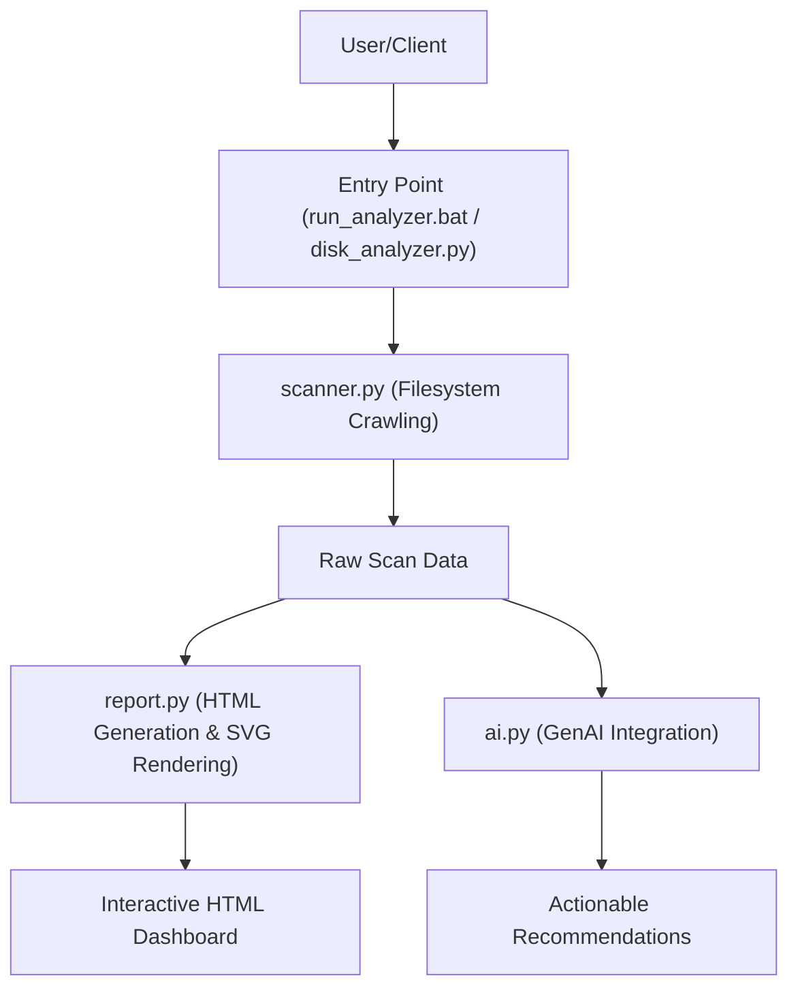

# disk-analyzer

A comprehensive local storage analysis tool that identifies large files, analyzes usage patterns by file extension, and generates interactive visual reports with AI-assisted insights.

## Description

`disk-analyzer` is a sophisticated system utility designed to provide deep visibility into how disk space is consumed on your machine. Unlike standard OS tools that only show high-level folder sizes, this project performs an exhaustive scan of the filesystem to identify specific "space hogs," categorize data by file types (e.g., media, logs, binaries), and flag temporary or cache directories that can be safely cleared.

The tool bridges the gap between raw system data and actionable information. It processes complex directory structures into a structured format which is then used to generate an interactive HTML report featuring SVG visualizations (donut charts for disk health) and dynamic bar charts for extension distribution. Additionally, it integrates with AI models via `google-genai` to provide intelligent recommendations on how to optimize storage based on the specific contents of your drive.

## Key Features

*   **Deep File Scanning:** Recursively analyzes directories to find large files (over 50MB) and high-usage folders.
*   **Extension Analytics:** Automatically aggregates file sizes by extension, providing a visual breakdown of what types of data occupy the most space.
*   **Smart Cleanup Detection:** Identifies common temporary paths and cache locations that are often overlooked during manual cleanup.
*   **Interactive Visual Reports:** Generates an HTML report featuring:
    *   Animated SVG donut charts for disk usage percentages.
    *   Dynamic bar charts with gradient styling to visualize extension distribution.
    *   Collapsible sections for a clean, navigable UI.
*   **AI-Powered Insights:** Leverages generative AI to analyze the file list and provide specific advice on what can be safely deleted or archived.

## Technologies

The project is built using a modern Python stack designed for system interaction and data processing:

*   **Python**: The core logic engine.
*   **psutil**: Used for retrieving hardware information, disk partitions, and mount points.
*   **google-genai**: Integration with Google's generative AI models to provide intelligent cleanup recommendations.
*   **HTML/CSS**: Utilized within `report_template.html` to create the final interactive dashboard.

## Installation

To set up the project locally for development or execution, ensure you have Python 3.x installed on your system.

1. Clone the repository:
```bash
git clone https://github.com/your-repo/disk-analyzer.git
cd disk-analyzer
```

2. Install the required dependencies using pip:
```bash
pip install -r requirements.txt
```

## Usage

The tool can be executed directly via a batch script for ease of use on Windows, or by running the Python modules directly.

### For End Users (Windows)
Run the provided batch file to start the analysis and generate the report:
```batch
run_analyzer.bat
```

### For Developers
You can run individual components or the main logic via the command line:
```bash
python disk_analyzer.py
```
*Note: Ensure you have your API keys configured in `config.py` if you wish to utilize the AI recommendation features.*

## Folder Structure

The project follows a modular structure where data collection, report generation, and AI logic are strictly separated:

- `ai.py`: Handles interactions with the Google GenAI models for generating cleanup advice.
- `config.py`: Central configuration file for paths, constants, and API keys.
- `disk_analyzer.py`: The main orchestrator that ties together scanning and reporting.
- `report_template.html`: A standalone HTML template containing CSS/JS for the interactive dashboard.
- `report.py`: Contains logic to transform raw scan data into formatted HTML components (SVG charts, tables).
- `scanner.py`: Low-level filesystem crawler that calculates sizes and identifies large items.
- `run_analyzer.bat`: A convenience script for launching the application on Windows systems.

## Architecture



## License

This project is unlicensed.

